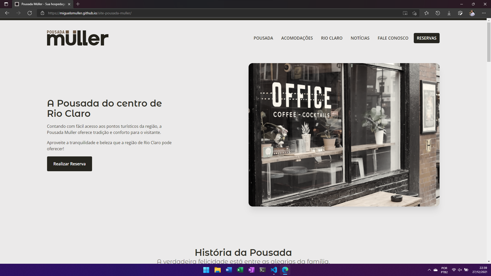

# **Site - Pousada Müller**


## **Overview**
Website developed for commercial purposes for Pousada Müller located in Rio Claro in the State of Rio Janeiro. The company that underwent a rebranding had the previous site done in [**WordPress**](https://wordpress.org/) and now has the new version being developed in **[Angular](https://angular.io/)**. Information about this [**older version**](#older-version) can be found in the topic below. 

- Feature 1
- Feature 2
- Feature 3
- [Need to be listed]

| [Repo V2013](https://github.com/miguelsmuller/site-hotel-muller) | [Demo v2022](https://pousada-muller.web.app/) |
|:----------------------------------------------------------------:|:---------------------------------------------:|

<br/>
  
## **Project Requirements**  
Make sure that you also have **[NodeJS](https://nodejs.org/)** and **[NPM](https://www.npmjs.com/)** installed on your computer.
- `$ node --version` and `$ npm --version`

Also make sure you have **Angular CLI** and **Firebase CLI** installed globally on your machine.  
- `$ npm install -g @angular/cli firebase-tools`

Install dependencies of project with:  
- `$ npm install`

#### **First run - Environment files**  
In the first execution of the project, it is **essential** to create the environment files (`environment.ts` and `environment.prod.ts`) in _**/src/environments**_ according to the model that follows inside the folder (`environment.example.ts`).

<br/>

## **Project Structure**  
```
src/                         project source code
|- app/                      app components
|  |- app.component.*        app root component (shell)
|  |- app.module.ts          app root module definition
|  |- app-routing.module.ts  app routes
|  +- ...                    additional modules and components
|- assets/                   app assets (images, fonts, sounds...)
|- environments/             values for various build environments
|- theme/                    app global scss variables and theme
|- index.html                html entry point
|- main.scss                 global style entry point
|- main.ts                   app entry point
```

<br/>

## **Workflow**  
**[WORKFLOW.md](WORKFLOW.md)** - This project uses the workflow pattern called `git flow`.
- [Atlassian - Comparing Workflows](https://www.atlassian.com/br/git/tutorials/comparing-workflows/gitflow-workflow)
- [Difference between workflows](https://www.zup.com.br/blog/git-workflow)
- [Girflow Cheatsheet](https://danielkummer.github.io/git-flow-cheatsheet/index.pt_BR.html)

<br/>

## **Tests**  
[Need to be implemented]

<br/>

## **Deploy**  
**[GITHUB ACTIONS](https://github.com/miguelsmuller/site-pousada-muller/actions/workflows/push-to-gh-pages.yml)** - To deploy to a demonstration of project hosted in GitHub Pages.

<br/>

## **Contributing**  
**[CONTRIBUTING.md](CONTRIBUTING.md)** - Specifications of how the contribution should be submitted

<br/>

## **Changelog**  
**[CHANGELOG.md](CHANGELOG.md)** - Chronologically list of changes for each version of a project

<br>

## **Screenshot**

